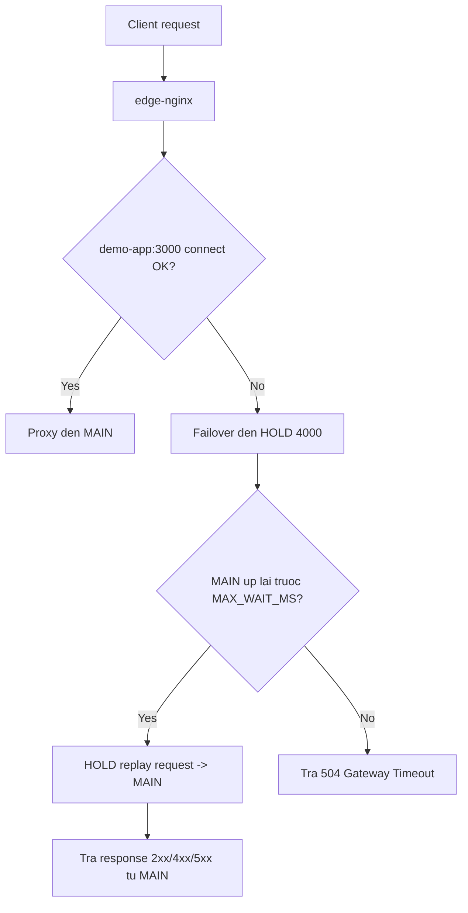
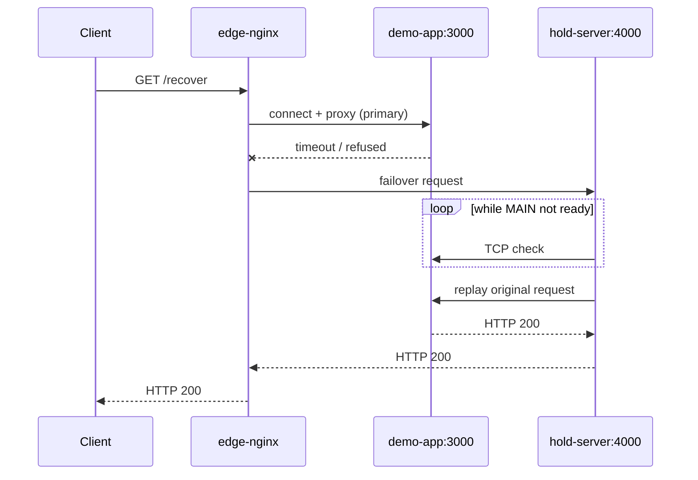

# Nginx Failover Hold-Revert (Near Zero-Downtime)

Template nay mo ta mot giai thuat don gian de giam downtime khi `main app` restart, deploy, hoac bi ngat tam thoi.

## Muc tieu
- Giu ket noi client khong bi roi ngay khi `main app` tam thoi down.
- Neu `main app` tro lai trong thoi gian cho, request dang cho se duoc forward tiep va tra ket qua `200`.
- Tao bo khung de sau nay mo rong: `main app` pull du lieu tu nhieu nguon ngoai, xu ly nang, nhung lop edge van on dinh.

## Giai thuat Hold-and-Revert
1. Client vao `edge-nginx`.
2. Nginx uu tien route den `demo-app:3000` (primary).
3. Neu primary khong connect duoc trong thoi gian ngan, Nginx failover sang `hold-server:4000` (backup).
4. `hold-server` giu request, poll trang thai `demo-app`.
5. Khi `demo-app` len lai trong `MAX_WAIT_MS`, `hold-server` proxy lai chinh request do ve `demo-app`.
6. Neu het `MAX_WAIT_MS` ma `demo-app` van chua san sang, tra `504`.

Loi ich: voi su co ngan, client nhin thay "request cham hon" thay vi "request fail ngay".

## Flow Chart


## Sequence Chart


## Thanh phan dich vu
| Service | Vai tro | Ghi chu |
|---|---|---|
| `edge-nginx` | Entry point + failover router | Upstream primary + backup |
| `demo-app` | Main business app | Port `3000` |
| `hold-server` | Hold request + replay | Port `4000`, cho MAIN hoi phuc |
| `tailscale` | Mang private cho runner (tuy chon) | Ho tro ket noi noi bo |
| `cloudflared` | Tunnel public/private (tuy chon) | Truy cap domain/tunnel |

## Cac bien cau hinh quan trong
| Bien | Mac dinh | Tac dung |
|---|---|---|
| `proxy_connect_timeout` (nginx) | `1s` | Thoi gian cho connect upstream moi lan thu |
| `MAX_WAIT_MS` | `90000` | Thoi gian HOLD cho MAIN hoi phuc |
| `CHECK_INTERVAL_MS` | `200` | Chu ky poll MAIN |
| `HOLD_AUTO_STOP_WHEN_MAIN_UP` | `false` | `false`: giu HOLD luon san sang de failover |
| `HOLD_MAIN_STABLE_MS` | `5000` | Window on dinh truoc khi auto-stop (neu bat) |
| `HOLD_IDLE_BEFORE_STOP_MS` | `1500` | Doi het inflight truoc khi stop (neu bat) |

## Chay nhanh local
```bash
docker compose up -d --build
curl -s http://localhost:8080/hello
```

## Test failover khong roi request
```bash
# 1) MAIN dang on
curl -s http://localhost:8080/hello

# 2) Gia lap MAIN down
docker stop demo-app

# 3) Gui request se bi hold
(curl -s --max-time 35 http://localhost:8080/recover > /tmp/out.txt) &

# 4) Khoi dong MAIN lai
sleep 3
docker start demo-app
wait

# 5) Ky vong van ra noi dung MAIN(3000), khong 504
cat /tmp/out.txt
```

## Mo rong lam template he thong thuc te
- Tach `ingest/pull worker` khoi request path:
  - Worker pull du lieu tu API/DB/queue ben ngoai.
  - Main app doc du lieu da duoc dong bo san (cache/store), giam phu thuoc real-time.
- Them health model 2 tang:
  - `liveness`: process con song.
  - `readiness`: da san sang phuc vu request.
- Them queue/noi luu tam cho tac vu nang:
  - Neu dependency cham, request van co the tra ket qua tam (hoac accepted) thay vi fail.
- Them metrics va tracing:
  - Theo doi `upstream_connect_time`, hold duration, timeout rate.

## Gioi han can biet
- Day la `near zero-downtime`, khong phai tuyet doi.
- Neu MAIN down lau hon `MAX_WAIT_MS`, client van nhan `504` (co chu dich de tranh treo vo han).
- Nen dat timeout theo SLO that su cua he thong.

## Cau truc thu muc
```text
.
├─ app/
│  ├─ Dockerfile
│  └─ main.js
├─ hold/
│  ├─ Dockerfile
│  └─ hold.js
├─ nginx/
│  └─ nginx.conf
├─ docker-compose.yml
└─ .github/workflows/deploy.yml
```
